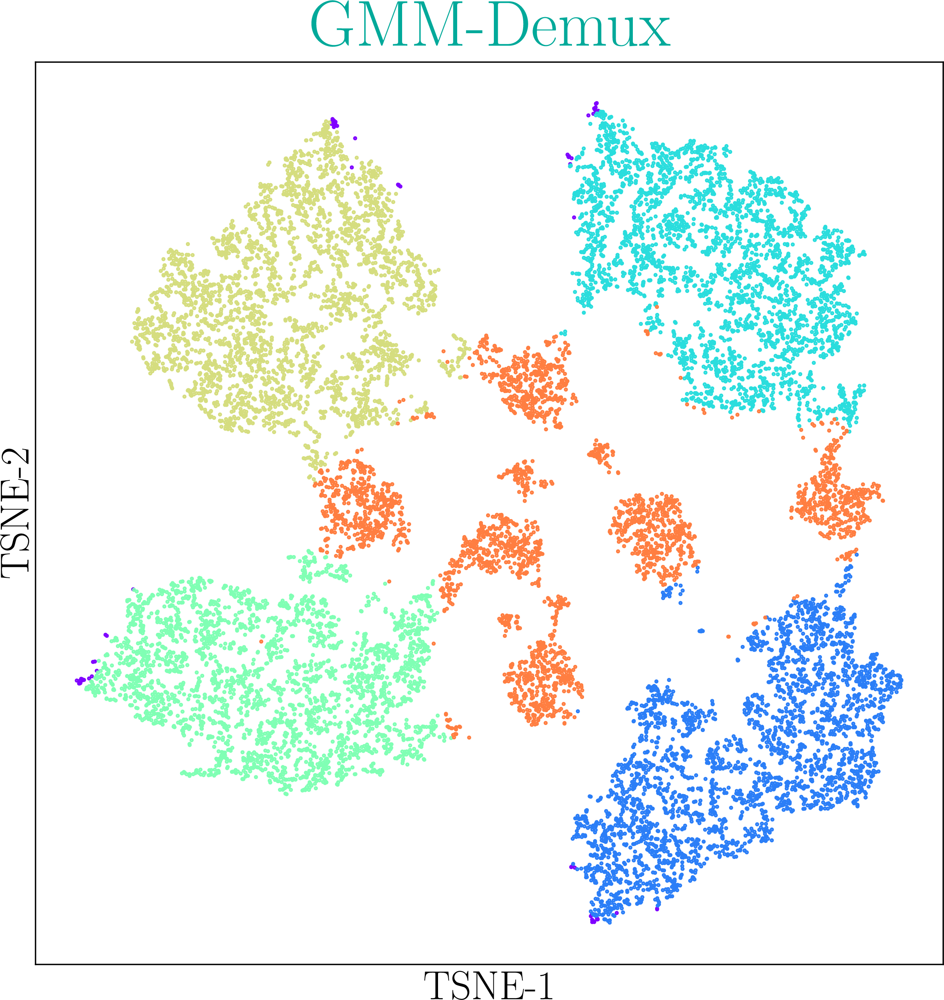
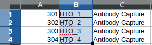
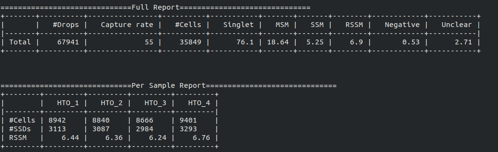
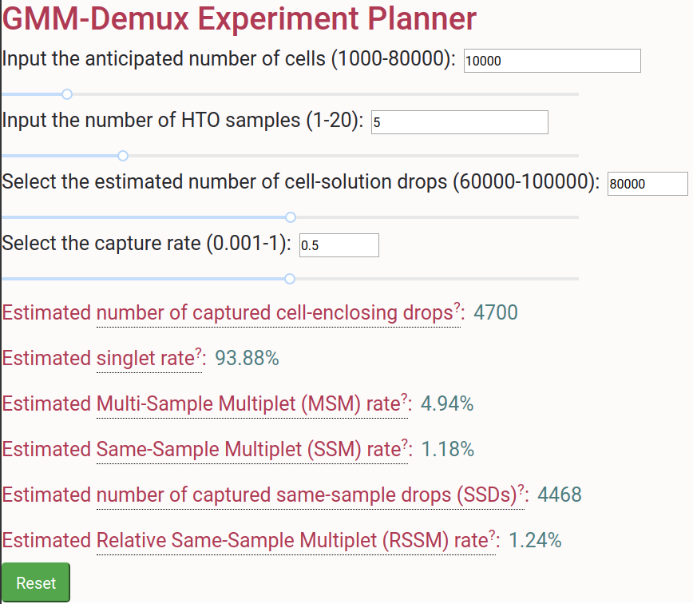

# GMM-Demux 
A Gaussian Mixture Model based software for processing cell hashing data.

Blow shows an example classification result. Orange dots are multi-sample multiplets.




## Description
GMM-Demux removes Multi-Sample-Multiplets (MSMs) in a cell hashing dataset and estimates the fraction of Same-Sample-Multiplets (SSMs) and singlets in the remaining dataset.

## Features
* Remove cell-hashing-identifiable multiplets from the dataset.
* Estimate the fraction of cell-hashing-unidentifiable multiplets in the remaining dataset (the RSSM value).

## Example Dataset
* An example cell hashing data is provided in the *example_input* folder. It contains the per drop HTO count matrix of a 4-sample cell hashing library prep.

# Authors
 Hongyi Xin, Qi Yan, Yale Jiang, Jiadi Luo, Carla Erb, Richard Duerr, Kong Chen* and Wei Chen*

# Maintainer
Hongyi Xin <xhongyi@pitt.edu>


## Requirement

GMM-Demux requires python3 (>3.5).

## Install

GMM-Demux can be directly installed from PyPi. Or it can be built and installed locally.

* Install GMM-Demux from PyPi.
```bash
pip3 install --user GMM_Demux
```
If choose to install from PyPi, it is unnecessary to download GMM-Demux from github. However, we still recommend downloading the example dataset to try out GMM-Demux.

* Install GMM-Demux locally using [setuptools](https://packaging.python.org/tutorials/installing-packages/) and pip3.
```bash
cd <GMM-Demux dir>
python3 setup.py sdist bdist_wheel
pip3 install --user . 
```

## Usage

Once installed, the github folder is no longer needed. Instead, GMM-Demux is directly accessible with the ```GMM-demux``` command.
```bash
GMM-demux <cell_hashing_path> <HTO_names> <estimated_cell_num>
```
MSM-free droplets are stored in folder *GMM_Demux_mtx* by default.

## Example Usage
An example cell hashing data is provided in *example_input*. <HTO_names> can be obtained from the features.tsv file.
```bash
GMM-demux example_input/outs/filtered_feature_bc_matrix HTO_1,HTO_2,HTO_3,HTO_4 35685
```

<HTO_names> are obtained from the features.tsv file. An example is shown below.



## Optional Arguments
* -h: show help information.
* -f FULL, --full FULL  Generate the full classification report. Require a path argument.
* -s SIMPLIFIED, --simplified SIMPLIFIED  Generate the simplified classification report. Require a path argument.
* -o OUTPUT, --output OUTPUT  Specify the folder to store the result. Require a path argument.
* -r REPORT, --report REPORT  Specify the file to store summary report. Require a file argument.
 
## Output Values
* CellRanger MSM-free drops, in MTX format. Compatible with CellRanger 3.0.
* Dataset summary. An example summary is shown below.


## Output Explanation
* MSM denotes the percentage of identified and removed multiplets among all droplets.
* SSM denotes the percentage of unidentifiable multiplets among all droplets.
* RSSM denotes the percentage of multiplets among the output droplets (after removing identifiable multiplets). RSSM **measures the quality of the cell hashing dataset**.

## Online Cell Hashing Experiment Planner
A GMM-Demux based online cell hashing experiment planner is publically accessible at [here](https://www.pitt.edu/~wec47/gmmdemux.html).

[](https://www.pitt.edu/~wec47/gmmdemux.html)
